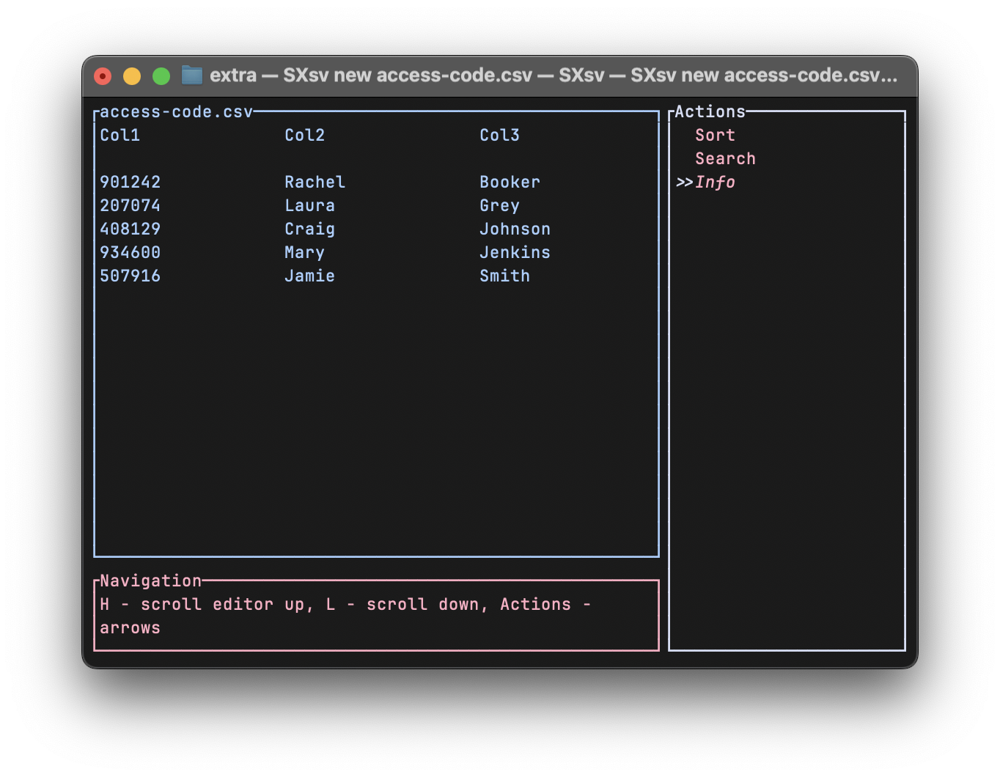
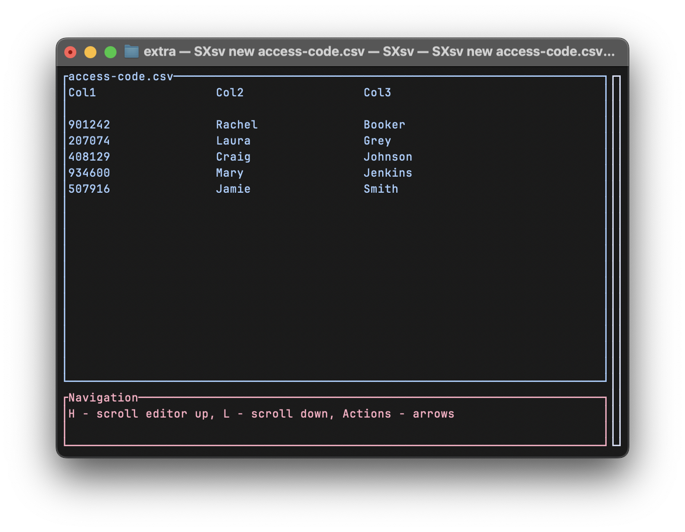
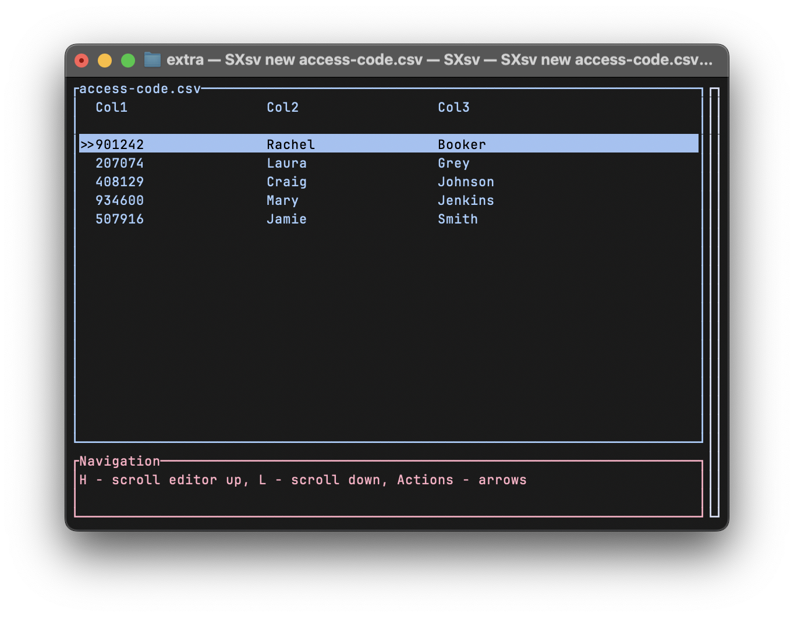

SXsv - quick data formats viewer and editor 
==========================================

Simple TUI interface can be easily accessed
from any platform and provide very clear 
and simple way of navigating a huge data 
collections.

The SXsv implements resizing adaption and 
refreshed dynamically so it is easy to use it from
GUI or straight from terminal with Tmux for example.

With an table widget navigate with highlighter 
and other useful features

